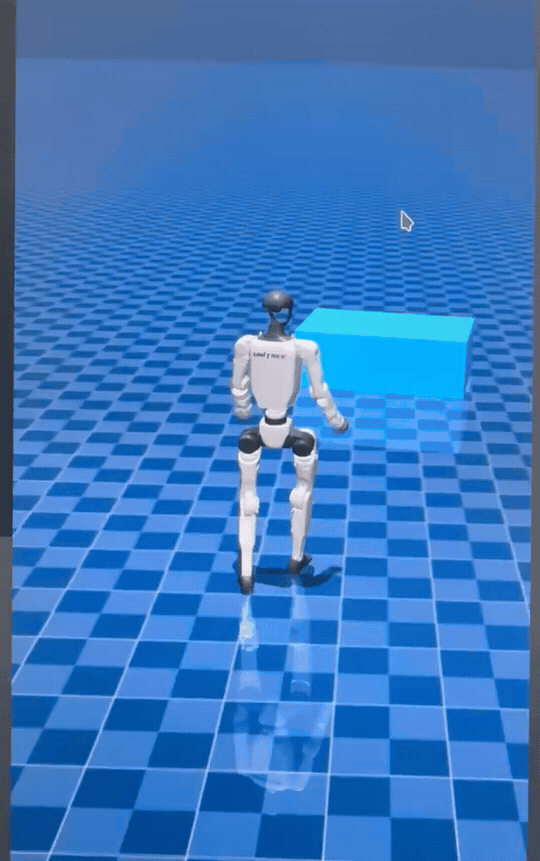

# go2_PIE

## Overview

`parkour_mjlab` is a reinforcement learning codebase built on MJLab for perceptive locomotion with Unitree G1 humanoid and Go2 quadruped robots.

## Installation

**Conda environment**

```bash
conda create -n mjlab python=3.11
conda activate mjlab
```

**Install dependencies**
```bash
sudo apt install -y libyaml-cpp-dev libboost-all-dev libeigen3-dev libspdlog-dev libfmt-dev
```

**Install parkour_mjlab**
```bash
git clone https://github.com/WwWv0v/go2_PIE.git
```

```bash
cd go2_PIE
pip install -e .
```

## Tasks

### 🐕 Go2

<details>
<summary><b>PIE</b></summary>

Train

```bash
python scripts/train.py Unitree-Go2-PIE \
  --agent.run-name stairs
```

Play

```bash
python scripts/play.py \
  --checkpoint-file logs/rsl_rl/go2_pie/model_8000.pt \
  --viewer viser \
  --network-depth-vis \
  --terrain-level 9 \
  --num-envs 1 \
  --device cuda:0
```

Native Sim2Sim

```bash
python deploy/pie/sim2sim/go2_pie_sim2sim.py \
  --checkpoint-file logs/rsl_rl/go2_pie/policy.onnx \
  --provider cpu \
  --terrain stairs \
  --joystick \
  --joystick-type xbox \
  --show-depth
```

</details>


### 🤖️ G1

<details>
<summary><b>Amp + Parkour Sim2Sim</b></summary>

```bash
python -m deploy.parkour.sim2sim --gamepad-type xbox --show-depth
```


手柄控制：

- 左摇杆：AMP 前进/横移速度；
- 右摇杆：AMP 转向速度；
- `LB+A`：切到 AMP；
- `LB+Y`：切到 Parkour；
- `LB+B`：重置机器人、回到 AMP。


</details>

<details>
<summary><b>Stair SDK2 Sim2Sim</b></summary>

Install
[`unitree_sdk2_python`](https://github.com/unitreerobotics/unitree_sdk2_python),
then start the MuJoCo server:

```bash
python deploy/stair/sim2sim/unitree_mujoco_stair_server.py \
  --show-depth --domain-id 6 --interface lo --duration 0
```

In a second terminal, start the controller:

```bash
python deploy/stair/sim2sim/g1_stair_unitree_mujoco.py \
  --checkpoint-file logs/rsl_rl/g1_stair/stair_test/policy.onnx \
  --domain-id 6 --interface lo --cmd-x 0.6 --duration 0
```

</details>

## Roadmap

- [x] Release the Go2 PIE training code
- [x] Release the Go2 PIE sim2sim deployment code (MuJoCo)
- [ ] Release the Go2 PIE sim2real deployment code
- [x] Release the G1 Stair sim2sim deployment code (MuJoCo + SDK2)
- [ ] Release the G1 Goal Stair code
- [ ] Release the G1 PHP code
- [ ] Release the G1 AME code
- [ ] Release the G1 CREF code

## Acknowledgements

- [MJLab](https://github.com/mujocolab/mjlab)
- [Isaac Lab](https://github.com/isaac-sim/IsaacLab)
- [unitree_rl_mjlab](https://github.com/unitreerobotics/unitree_rl_mjlab)
- [unitree_mujoco](https://github.com/unitreerobotics/unitree_mujoco)
