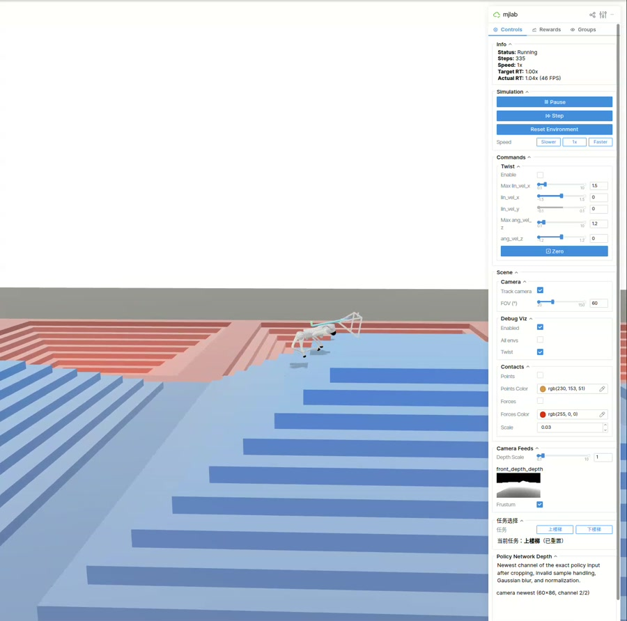

# go2_PIE

## Overview

`parkour_mjlab` is a reinforcement learning codebase built on MJLab for perceptive locomotion with the Unitree Go2 quadruped robot.

## Real-World Demo

[](docs/go2_real_world_demo.mp4)

## Installation

**Conda environment**

```bash
conda create -n mjlab python=3.11
conda activate mjlab
```

**Install dependencies**
```bash
sudo apt install -y libyaml-cpp-dev libboost-all-dev libeigen3-dev libspdlog-dev libfmt-dev
```

**Install parkour_mjlab**
```bash
git clone https://github.com/WwWv0v/go2_PIE.git
```

```bash
cd go2_PIE
pip install -e .
```

## Tasks

<details>
<summary><b>PIE</b></summary>

Train

```bash
python scripts/train.py Unitree-Go2-PIE \
  --agent.run-name stairs
```

Play

```bash
python scripts/play.py \
  --checkpoint-file logs/rsl_rl/go2_pie/model_8000.pt \
  --viewer viser \
  --network-depth-vis \
  --terrain-level 9 \
  --num-envs 1 \
  --device cuda:0
```

Native Sim2Sim

```bash
python deploy/pie/sim2sim/go2_pie_sim2sim.py \
  --checkpoint-file logs/rsl_rl/go2_pie/policy.onnx \
  --provider cpu \
  --terrain stairs \
  --joystick \
  --joystick-type xbox \
  --show-depth
```

</details>

## Roadmap

- [x] Release the Go2 PIE training code
- [x] Release the Go2 PIE sim2sim deployment code (MuJoCo)
- [ ] Release the Go2 PIE sim2real deployment code

## Acknowledgements

- [MJLab](https://github.com/mujocolab/mjlab)
- [Isaac Lab](https://github.com/isaac-sim/IsaacLab)
- [unitree_rl_mjlab](https://github.com/unitreerobotics/unitree_rl_mjlab)
- [unitree_mujoco](https://github.com/unitreerobotics/unitree_mujoco)
